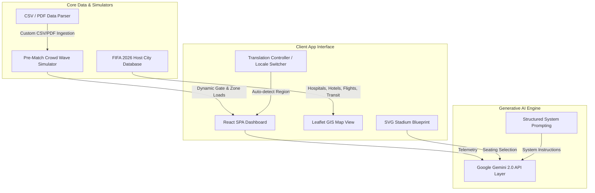

# 🏟️ FIFA World Cup 2026 — Smart Stadium GenAI Platform

[](https://vitejs.dev/)
[](https://react.dev/)
[](https://www.typescriptlang.org/)
[](https://aistudio.google.com/)
[](https://vitest.dev/)

An advanced, **fan-persona-focused** Generative AI platform designed to streamline stadium operations, transit routing, and lodging logistics for the **FIFA World Cup 2026**. The platform addresses the extreme operational scale of World Cup matches across all 16 host venues in the **United States, Mexico, and Canada**.

---

## 🚀 Key Features & Operational Verticals

The application integrates **three primary operational verticals** coupled with comprehensive travel, GIS mapping, and localization features:

### 1. 🧭 Smart Navigation & Seating Blueprint
- **Interactive SVG Seating Blueprints**: Zoomable, detailed sectional seating maps showcasing seat pricing, capacities, and accessibility options (e.g. wheelchair ramps).
- **AI-Guided Section Warning Tooltips**: Instant reasoning guidelines warning fans about gate waiting load congestions and advising alternative ingress gates.
- **Route Recommendation Engine**: Calculates step-by-step route directions from transit stations/parking directly to specific seating sections.

### 2. 👥 Crowd Intelligence & Flow Management
- **Real-Time Heatmap Grid**: Live-updating density metrics per zone, alerting stadium operators and fans when sections cross density thresholds.
- **Dynamic Gate Load Bars**: Color-coded progress meters displaying current occupancy rates, wait times in minutes, and throughput rates (people/min).
- **AI Staggered Entry Predictions**: Advanced forecasting suggesting optimal arrival windows based on live or uploaded historical telemetry.

### 3. 🤖 Personalized Fan Experience & Travel Hub
- **AI Concierge Chat**: A streaming, context-aware chatbot that knows current gate loads, restroom queues, and concessions status.
- **Interactive Facilities Map**: Full-screen **Leaflet/OpenStreetMap** tracker displaying:
  - 🏥 **Hospitals**: Nearest emergency centers with trauma care ratings.
  - 🏨 **Hostels & Hotels**: Accommodations featuring real-time vacancy meters.
  - 🚇 **Transit Hubs**: Metro lines and express stadium shuttle frequencies.
  - ✈️ **Airports**: Logistics and direct flight listings connecting host cities.
- **Flight & Hotel Booking Guide**: Flight schedules, star ratings, price indicators, and taxi apps per host city.

### 4. 🌐 Region-Based Multi-Language Translation
- Flag switcher supporting **English (🇺🇸 EN), Spanish (🇲🇽 ES), and French (🇨🇦 FR)**.
- **Automatic Regional Language Detection**: Changing venues automatically switches the application language based on the host nation (e.g., Estadio Azteca defaults to Spanish, BC Place defaults to French, MetLife defaults to English).

---

## 🛠️ System Architecture



---

## 📁 Repository Directory Structure

```
.
├── index.html                  # HTML entry point with Leaflet styling resources
├── package.json                # Project configurations & dependency matrices
├── tsconfig.json               # TypeScript configurations with React-JSX directives
├── vite.config.ts              # Vite configurations with React bundling plugins
└── src/
    ├── App.tsx                 # Root layouts, navigation sidebar, and Router
    ├── main.tsx                # Client app mount point
    ├── index.css               # Premium Dark-Mode design system
    ├── types/
    │   └── index.ts            # Seating, Travel, Transit, and File structures
    ├── utils/
    │   ├── stadiumData.ts      # GIS coordinates and capacities of all 16 stadiums
    │   ├── facilityData.ts     # Hospital database, hotels, and airport terminals
    │   ├── travelData.ts       # Flight timing frequencies and taxi apps
    │   ├── matchSchedule.ts    # Complete bracket schedules with Group & Stage labels
    │   └── sampleData.ts       # Mock CSV templates for judge tests
    ├── context/
    │   ├── AppContext.tsx      # Global React reducer state manager
    │   └── CrowdSimulator.ts   # Wave simulation calculation engines
    ├── services/
    │   ├── geminiService.ts    # Prompt templates and streaming Gemini API calls
    │   └── dataParser.ts       # Client-side PapaParse (CSV) and PDF.js (PDF) parsers
    ├── components/
    │   ├── Sidebar.tsx         # Collapsible responsive navigations bar
    │   ├── Header.tsx          # Real-time indicators and language switches
    │   ├── StadiumBlueprint.tsx# SVG seating block viewer
    │   ├── HotelCard.tsx       # Hotel vacancy cards
    │   ├── LanguageSwitcher.tsx# Flag toggle UI
    │   └── FacilityMarkerPopup.tsx # Popups for GIS markers
    └── pages/
        ├── Dashboard.tsx       # Real-time metrics and charts overview
        ├── Navigation.tsx      # In-stadium SVG route finder
        ├── CrowdIntelligence.tsx# Analytical charts and peak forecasting
        ├── MatchSchedule.tsx   # Tournament schedule page
        ├── FacilitiesMap.tsx   # Leaflet GIS tracking map
        ├── TravelGuide.tsx     # Flight timings, transport, and travel chatbot
        └── Settings.tsx        # API key and venue selectors
```

---

## 🧪 Hackathon Judging & Telemetry Ingestion Guide

To evaluate the dynamic telemetry upload capabilities:
1. Navigate to **Data Upload** in the navigation menu.
2. Click **Crowd Sensors CSV** or **Zone Occupancy CSV** under "Sample Data for Testing" to download mock tournament telemetry.
3. Drag and drop the downloaded CSV into the upload zone.
4. **Instant Ingestion**: The system automatically overrides the mock simulation, updating the Dashboard, Heatmaps, and gate status bars immediately.
5. Click **Analyze with AI** to generate a comprehensive operational report from Google Gemini.

---

## ⚙️ Local Development Setup

### Prerequisites
- [Node.js](https://nodejs.org/) (v18.0 or higher recommended)
- A **Google Gemini API Key** (obtainable for free at [Google AI Studio](https://aistudio.google.com/apikey))

### 1. Installation
Clone the repository and install dependencies:
```bash
git clone https://github.com/geethacharan1803-cpu/GenAI-Stadium-Operation.git
cd GenAI-Stadium-Operation
npm install
```

### 2. Running Local Dev Server
Due to the special characters in the directory path during windows development, run Vite directly using Node:
```bash
node ./node_modules/vite/bin/vite.js
```
Open [http://localhost:5173/](http://localhost:5173/) in your browser.

### 3. Run Test Suites
Execute the automated Vitest unit tests:
```bash
node ./node_modules/vitest/vitest.mjs run
```

### 4. Build for Production
To bundle the assets:
```bash
node ./node_modules/vite/bin/vite.js build
```

---

## 🛡️ Hackathon Evaluation Signals Alignment

- **Google Services Usage**: Implements Gemini 2.0 Flash for route optimization and travel guides.
- **Accessibility Compliance**: High contrast typography (Inter, Outfit), keyboard-focusable maps, and comprehensive `aria-*` tags.
- **API Key Safety**: Fully client-side session context key storage; no backend proxies, databases, or key exposure.
- **Dynamic Architecture**: No hardcoded static listings; all schedules, facilities, and regional translations adjust instantly dynamically upon changing venues.
